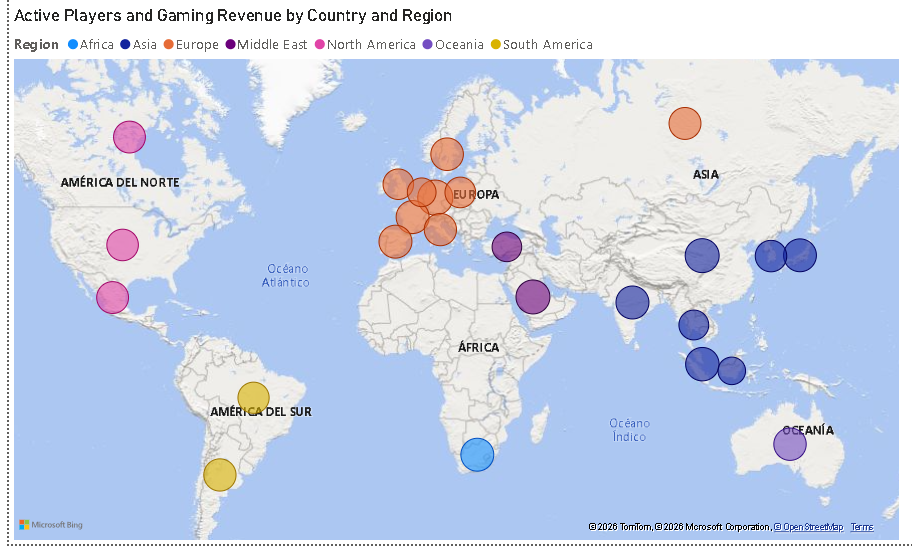

# Análisis Global de la Industria de Gaming y Esports (2010-2025)

## 📝 Descripción del Proyecto
Este proyecto presenta un análisis histórico y predictivo de la evolución de la industria del **Gaming y los Esports a nivel global**, abarcando un periodo de 15 años (2010 a 2025). 

A través de un dashboard interactivo en Power BI, se consolidan y examinan datos de 25 países clave para entender el comportamiento de los ingresos, audiencias, adopción tecnológica y demografía de los jugadores. El objetivo es ofrecer una herramienta de business intelligence que permita a inversores, desarrolladores y organizadores de eventos identificar mercados de alto crecimiento y tendencias tecnológicas.

---

## 📈 KPIs y Métricas Principales del Dashboard
El reporte monitorea y analiza las siguientes métricas clave extraídas del dataset:
* **Ingresos de Mercado:** Comparativa entre los ingresos por Gaming tradicional (Billion USD) y el ecosistema Esports (Million USD).
* **Análisis de Audiencia:** Relación entre jugadores activos generales (Active Players) y espectadores específicos de Esports (Viewers).
* **Evolución Competitiva:** Mapeo del total de torneos realizados y número de jugadores profesionales por región.
* **Incentivos Económicos:** Crecimiento de las bolsas de premios (Prize Pools) y su correlación con la densidad de empresas de videojuegos.
* **Inclusión y Demografía:** Porcentaje de participación de mujeres gamers e impacto de las plataformas móviles (Mobile Share).
* **Factores Técnicos e Impacto Social:** Monitoreo del índice de penetración de Internet, latencia promedio y análisis del impacto histórico de la pandemia (Covid Impact Index).

---

## 🚀 Funcionalidades Avanzadas en Power BI
* **Filtros Temporales y Geográficos:** Segmentación dinámica por Año, Región (Asia, Europa, Sudamérica, etc.) y País.
* **Análisis de Preferencias:** Gráficos interactivos de los géneros de videojuegos líderes (*Top Genre* como FPS, RPG, MOBA, Strategy, Sports) y plataformas predominantes (*Top Platform* como PC, Mobile, Console).
* **Modelado de Datos Dinámico:** Implementación de medidas DAX complejas para calcular el crecimiento año a año (YoY %) de los ingresos y el gasto promedio por usuario (*Avg Spending*).
* **Visualización Tecnológica:** Matriz de correlación entre la infraestructura de red (latencia y penetración de internet) frente al índice de adopción de tecnologías AR/VR.

---

## 🛠️ Tecnologías y Herramientas Utilizadas
* **Power BI Desktop:** Modelado de datos, diseño de la interfaz de usuario (UI/UX) y analítica visual.
* **Power Query:** Proceso de ETL para estandarizar tipos de datos (monedas, enteros y decimales) de los 15 años de registros.
* **DAX (Data Analysis Expressions):** Creación de métricas de inteligencia de tiempo y cálculos demográficos ponderados.
* **Origen de Datos:** Dataset en formato CSV con registros históricos desde 2010 hasta 2025.

---

## 📊 Estructura del Repositorio
* `📂 data/`: Contiene el archivo CSV original con las métricas históricas de Gaming y Esports.
* `📂 images/`: Capturas de pantalla del reporte interactivo y del modelo de datos.
* `📂 reports/`: Archivo `.pbix` del proyecto.

---

## 🕹️ ¿Cómo ver el reporte?

1. **Descarga Local (Recomendada):** * Descarga el archivo `.pbix` que se encuentra en la carpeta `reports/`.
   * Ábrelo con [Power BI Desktop](https://powerbi.microsoft.com/desktop/) (gratuito).
2. **Vista Rápida:** Si no tienes la herramienta instalada, puedes revisar las capturas estáticas compartidas en la carpeta `images/`.

---

## 👤 Autor
* **Abel QA** - [Tu perfil de LinkedIn](https://www.linkedin.com/in/abel-quintanilla-albites-177012176/)
